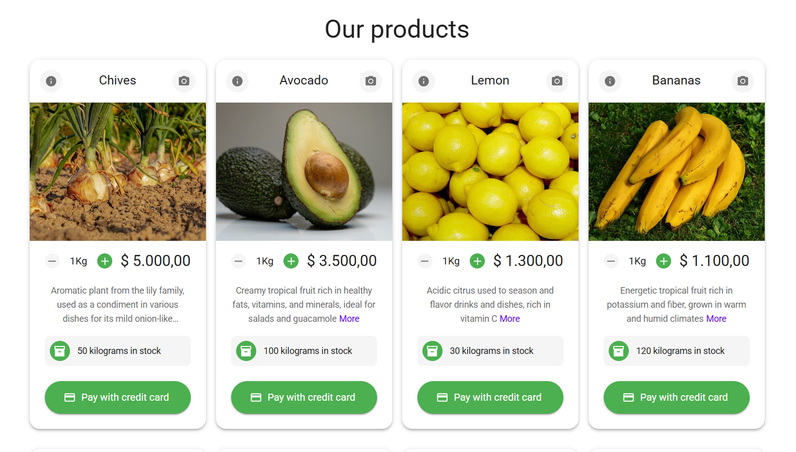
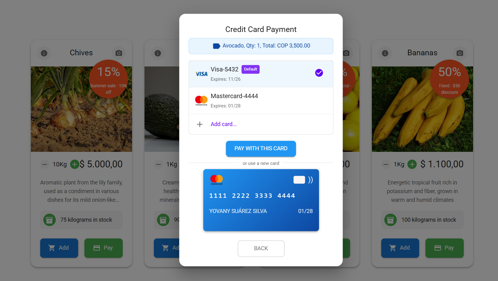

<p align="center">
  <a href="http://nestjs.com/" target="blank"></a>
</p>

<h1 align="center">🚨 Simple payment web application</h1>

[circleci-image]: https://img.shields.io/circleci/build/github/nestjs/nest/master?token=abc123def456
[circleci-url]: https://circleci.com/gh/nestjs/nest

  <p align="center">A simple payment web application for product payments.</p>
    <p align="center">
<a href="https://reactjs.org" target="_blank"></a>
<a href="https://www.typescriptlang.org" target="_blank"></a>
<a href="https://mui.com" target="_blank"></a>
<a href="https://vitejs.dev" target="_blank"></a>
<a href="https://socket.io" target="_blank"></a>
<a href="https://axios-http.com" target="_blank"></a>
<a href="https://reactrouter.com" target="_blank"></a>
<a href="https://react.dev/reference/react/createContext" target="_blank"></a>
<a href="https://jestjs.io" target="_blank"></a>
<a href="https://prettier.io" target="_blank"></a>
<a href="https://eslint.org" target="_blank"></a>
</p>

## Description📍

Simple Payment Web Application.  This app allows you to operate the payment logic and go through a payment gateway, applying a discount to the inventory if the payment is successful.

## Preview 📸

<p align="center">
  
</p>
<p align="center">
  
</p>

## Project setup ✅

```bash
# clone the project
$ git clone https://github.com/desobsesor/simple-payment-web.git

# install dependencies
$ npm install
```

## Compile and run the project 🛠

```bash
# development
$ npm run dev

# build
$ npm run build

# preview
$ npm run preview
```
## Running the app 🚀

To view the application, open your browser and navigate to:

```bash
http://localhost:5173/
```

## Run tests 🚀

```bash
# unit tests
$ npm run test

# e2e tests
$ npm run test:e2e

# test coverage
$ npm run test:cov
```
## About API consumer 🚀
The API consumer is a simple React application that allows you to interact with the API. To run the API consumer, you need to have the API running. You can find the API in the following repository:


```bash
git clone http://github.com/desobsesor/simple-payment-api.git
```


## Deployment 🖥

When you're ready to deploy your React application to production, there are some key steps you can take to ensure it runs as efficiently as possible. Check out the [deployment documentation](https://reactjs.org/docs/deployment.html) for more information.


## Built with 🛠️

_Tools and Technologies used_

- [React](https://reactjs.org/) - A JavaScript library for building user interfaces
- [TypeScript](https://www.typescriptlang.org/) - Typed JavaScript at Any Scale
- [Material UI](https://mui.com/) - React components for faster and easier web development
- [Jest](https://jestjs.io/) - JavaScript Testing Framework
- [Prettier](https://prettier.io/) - Code formatter
- [ESLint](https://eslint.org/) - Pluggable JavaScript linter

## Support 🔍

This project is an open source project. It can grow thanks to the sponsors and support by the amazing backers. If you'd like to join them, please [read more here](https://reactjs.org/community/support.html).

## Versioned 📌

[SemVer](http://semver.org/) is used for versioning. For all versions available.

## Author ✒️

_Built by_

- **Yovany Suárez Silva** - _Full Stack Software Engineer_ - [desobsesor](https://github.com/desobsesor)
- Website - [https://portfolio.cds.net.co](https://desobsesor.github.io/portfolio-web/)


## License 📄

This project is under the MIT License - see the file [LICENSE.md](LICENSE.md) for details
